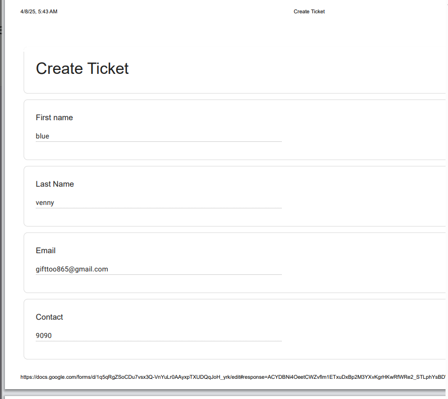
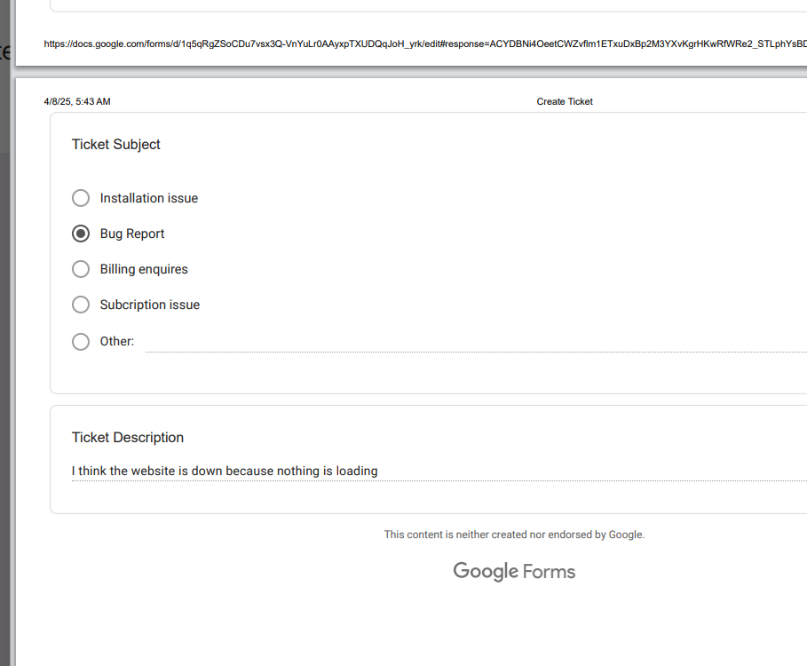
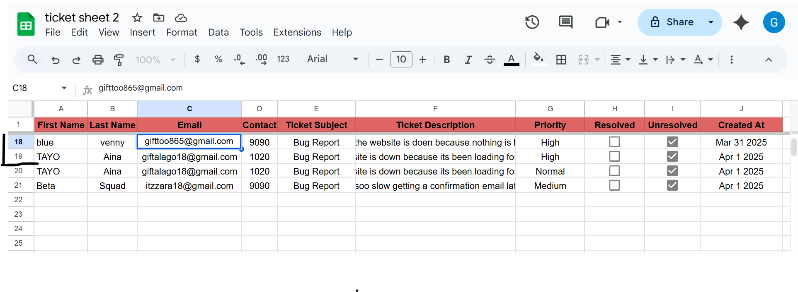
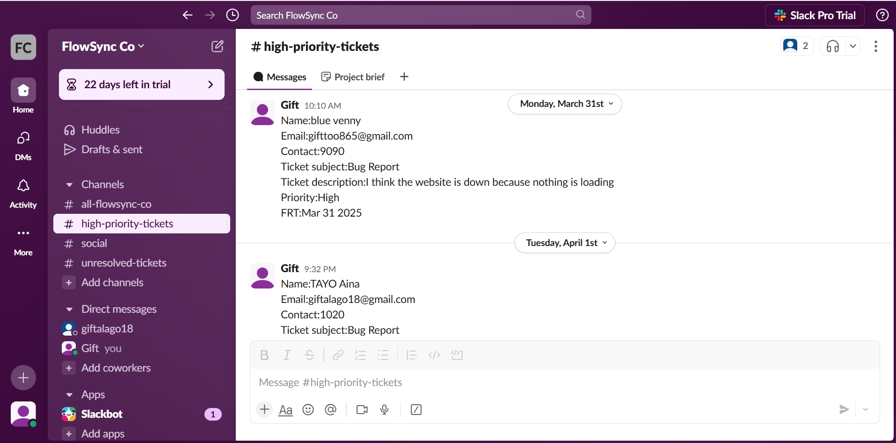
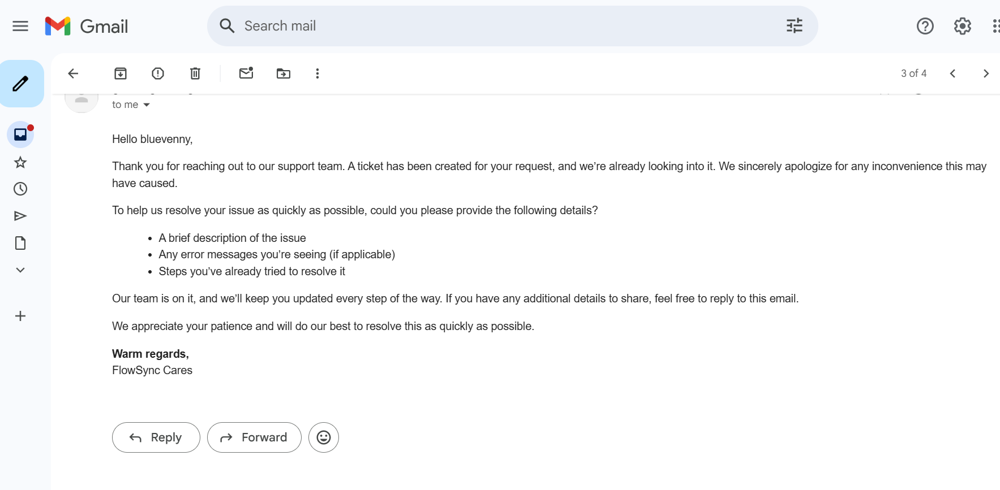
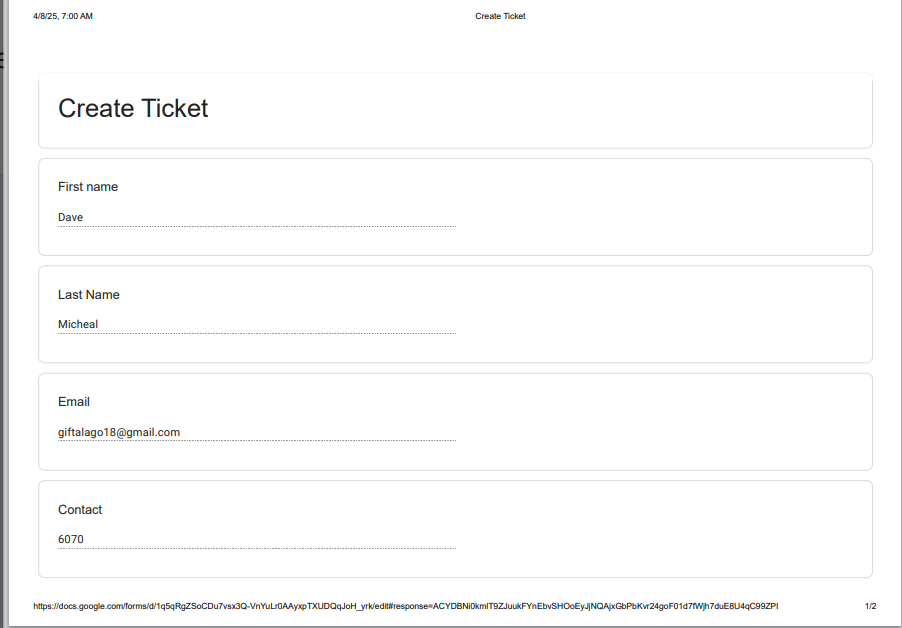
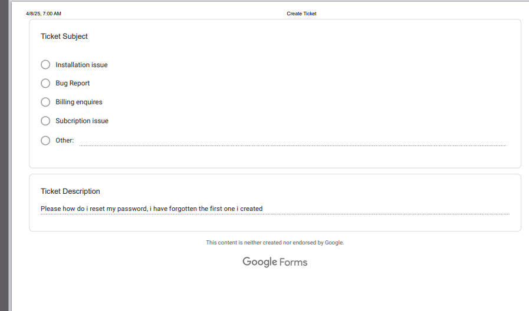
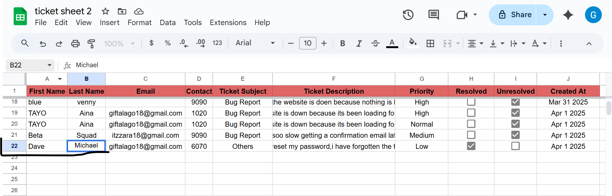
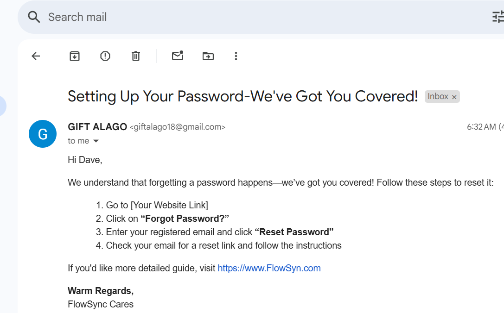
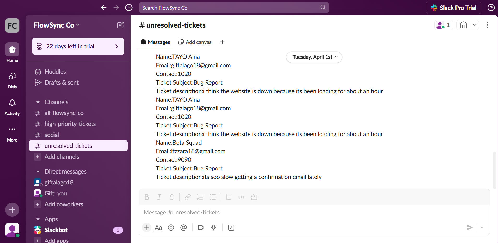

# 🎯 Support Ticket Workflow Automation

## 📌 Overview

**Customer Support Shouldn't Be Robotic!**

Traditional customer support often involves repetitive tasks: sorting tickets, assigning priority, and replying to the same inquiries. This automation eliminates busywork by:

- Automatically categorizing incoming tickets by urgency
- Notifying the right team via Slack in real-time
- Sending personalized emails instantly
- Summarizing unresolved tickets at the end of the day

**Result?** Faster response, fewer manual steps, and improved customer experience.

---

## 💡 Why This Matters

In a digital-first world, fast proactive support equals **customer retention and revenue**.

> 🧾 According to Zendesk (2023):  
> - 83% of customers expect immediate support.  
> - 60% will switch providers after just one or two bad experiences.

> 🧾 McKinsey found automation improves response and resolution time by up to **50%**.

Yet, over **50%** of support teams still use manual routing (Freshdesk, 2022).  
This project tackles that challenge directly.

---

## 🛠️ Tech Stack

| Tool                        | Purpose                                   |
|-----------------------------|-------------------------------------------|
| **Make.com**                | Workflow and automation engine            |
| **Google Forms**            | Customer ticket submission form           |
| **Google Sheets**           | Ticket database and tracking              |
| **Text Parser (Make.com)**  | Extracts priority keywords                |
| **Slack API via Make.com**  | Real-time team notifications              |
| **Email via Make.com**      | Sends automated, personalized responses   |
| **Google Apps Script** (opt)| Custom logic or data formatting           |

---

## ⚙️ Workflow Overview

### 1️⃣ Ticket Submission via Google Form

Customers submit issues through a Google Form.  
Responses are auto-logged into Google Sheets.

📸 **EXAMPLE:**

#### Google Form

      

#### Sheet Logging

---

### 2️⃣ Automatic Categorization via Text Parser

Based on keywords, tickets are automatically tagged as:

| Priority Level | Keyword Examples |
|----------------|------------------|
| High           | "urgent", "site is down", "not working"  |
| Medium         | "error", "broken", "glitch"              |
| Low            | "how", "setup", "feedback", "question"   |

> 🔁 Follow-up messages without resolution are **auto-escalated** to High Priority.

---

### 3️⃣ Automated Actions Based on Priority

#### 🟥 High Priority
- Slack notification to `#High-priority`
  

- Personalized confirmation email to the customer

   

#### 🟧 Medium Priority
- Slack notification to `#support-tickets`
- Customer receives a response acknowledging the issue

#### 🟩 Low Priority
- Customer receives an email with:
  - Help article links (e.g., password reset, how-tos)
  - Invitation to visit the FAQ

    📸 Example:

- A customer asks: _"How do I reset my password?"_

> A customer submits a google form,asking how to reset passoword
  
 

> The ticket is logged into google sheets
 

> Auto-email response with instructions and FAQ link  

---

### 4️⃣ End-of-Day Report

At the end of each workday:
- Google Sheets is checked for unresolved tickets
- A Slack message is sent to summarize pending tickets

📸 Example:

> 🚨 "3 Unresolved Tickets Today"

---

## 🔎 Ticket Priority Logic

| Priority | Description |
|----------|-------------|
| **High** | Site access issues, broken core features, repeated messages |
| **Medium** | Minor bugs, errors, visual glitches |
| **Low** | How-to questions, setup help, general feedback |

🔁 *Follow-up tickets escalate automatically.*

> examples of high priority tickets
- “I can’t log in to my account — says error 403.”
- “Our dashboard is down, and we can’t access customer data.”
- “Still waiting on a fix — is anyone seeing my messages?”

> examples of medium priority tickets
- “Charts are not loading correctly on the analytics page.”
- “I’m getting a pop-up error when I upload files.”
- “The filter is buggy but I can still use the page.”

> examples of low priority tickets
- “How do I reset my password?”
- “Can you help me set up email alerts?”
- “Just a suggestion — it’d be nice to export reports as CSV.”
---

## 🚀 Benefits of This Automation

- ⏱️ **Faster Acknowledgment & Routing**
- 🧠 **Less Manual Work** = More Time for Complex Issues
- 📚 **Self-Service for Low Priority Tickets**
- 📊 **Real-Time Ticket Logging and Visibility**
- 🔔 **Proactive Alerts and Follow-ups**
- 📅 **End-of-Day Summaries Keep Teams in Sync**

---
## 📘 Lessons Learned

Through this project, I gained hands-on experience in:

- Designing and optimizing automation workflows using Make.com
- Real-world Slack and email integrations for tech support
- Building proactive support experiences using data parsing and keyword logic
- Communicating ticket statuses with clarity and speed

---

## 🔄 Potential Improvements

To scale this system, future upgrades could include integration with:

- **Zendesk, Freshdesk, or HubSpot Service Hub** for advanced SLA tracking
- **CRM tools** to include user history in ticket handling
- **AI-powered NLP tools** for smarter ticket classification
- **Multi-channel support**: Live chat, social media, and in-app tickets

---
## ✅ Conclusion

This automation project demonstrates how **no-code tools** can power high-impact workflows in support operations. It bridges the gap between speed and quality, helping support teams respond faster, work smarter, and keep customers happy.

---
