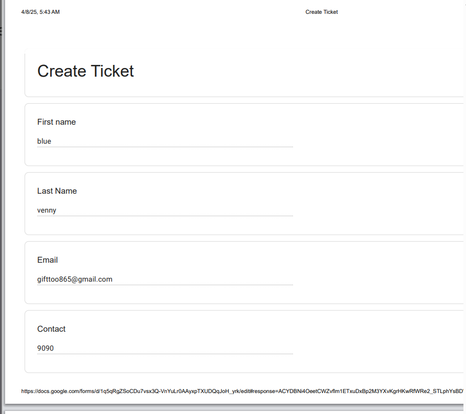
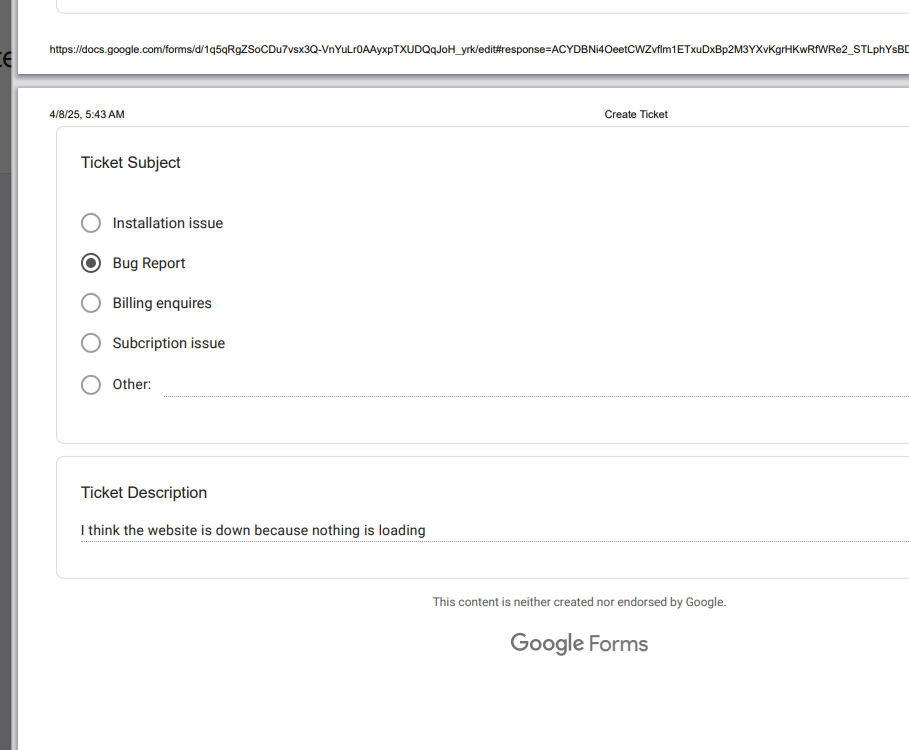
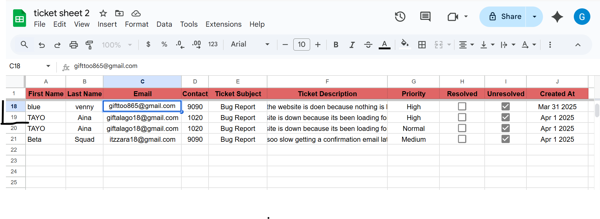
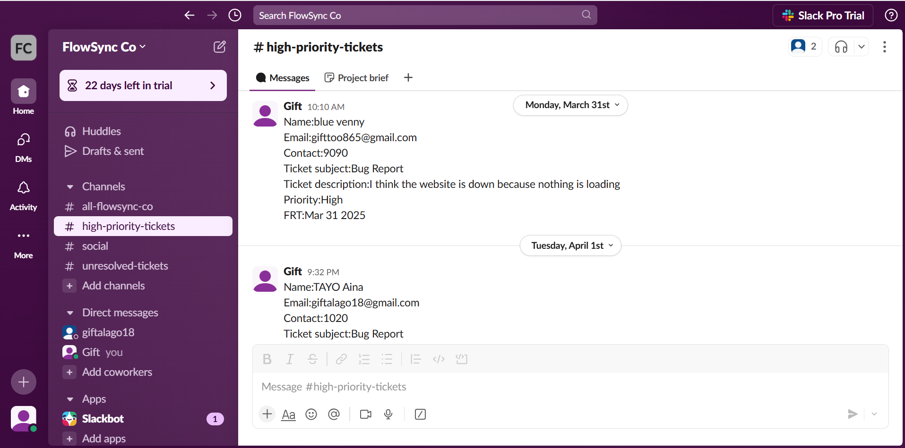
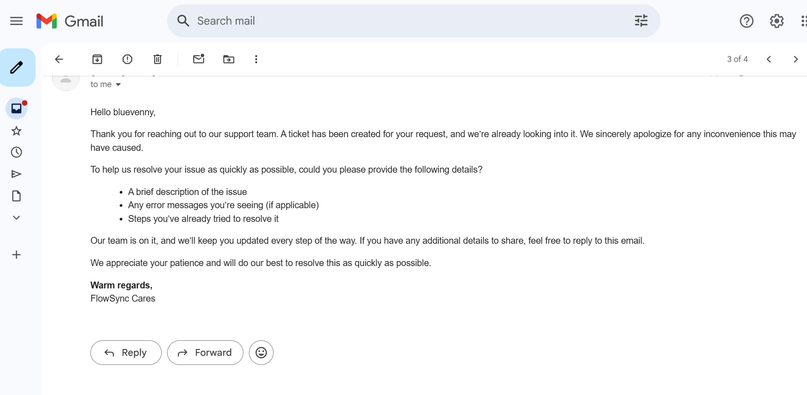
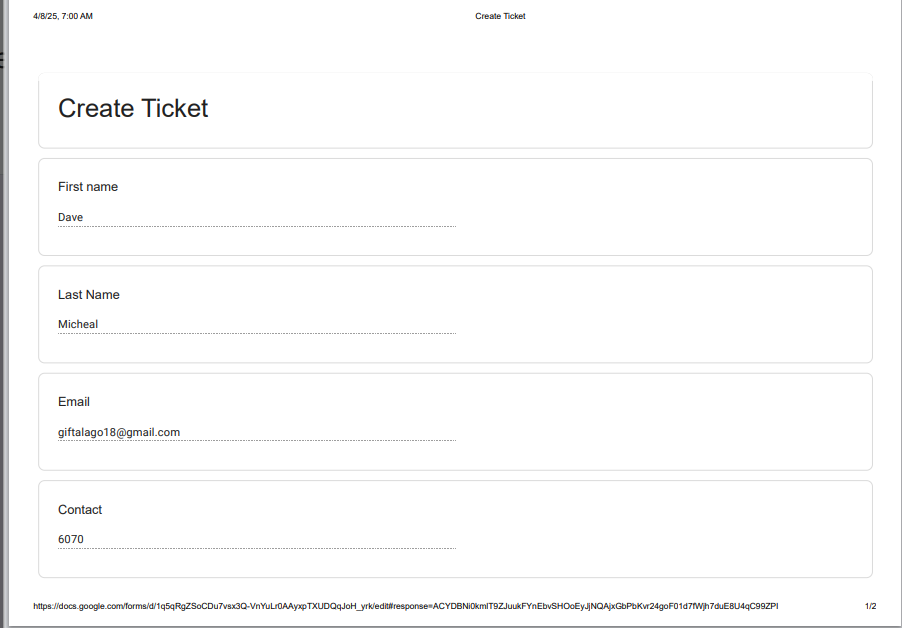
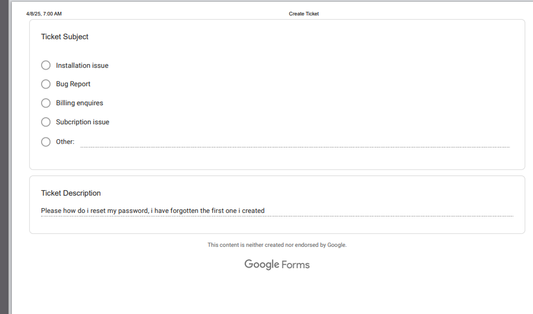
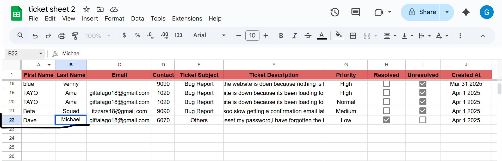
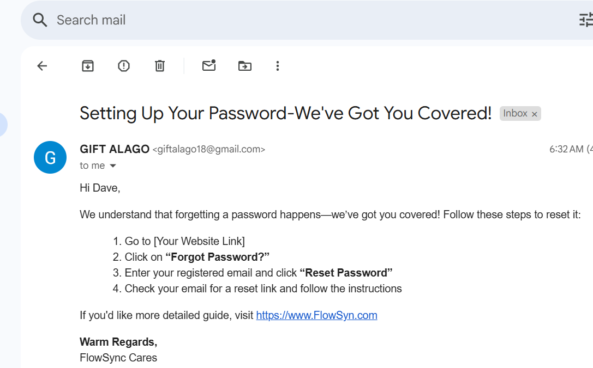

### Automated Support Ticket Processing System

## 📌  Introduction
**Customer Support Shouldn't Be Robotic**

Traditional customer  support is filled with repetitive tasks like sorting tickets and sending the same replies.But support should be exciting--every day brings new challenge to solve.This automation cuts through the noise by handling routine tasks,prioritizing urgent isues, and instantly notifying the right team.**The result? Faster response, less manual work, and better customer experience**

 ## 💡 Why This System?
 In today's digital-first economy, customer support speed and efficiency directly impact retention, satisfaction, and revenue.

According to a 2023 Zendesk Customer Experience Trends Report:

83% of customers expect to interact with someone immediately when contacting a company.
And 60% will switch to a competitor after just one or two bad experiences.

Yet, companies still struggle:

- Over 50% of support teams still rely on manual triaging and routing of tickets (Freshdesk Report, 2022).

- Delays in response time are the #1 cause of low satisfaction scores in customer service (HubSpot, 2023).

**Why This Matters for Business Outcomes**
Let’s tie this back to results:

- McKinsey found that companies using automation in customer support saw 30%–50% improvement in response speed and resolution time.
- "Businesses lose $62 billion each year due to poor customer service — much of that is from delayed or non-personalized responses|" --NewVoiceMedia.

**Handling support tickets manually** can be time-consuming and prone to delays. This project solves these challenges by automating:
- ✅ Ticket submission via Google Forms
- ✅ Categorization based on priority keywords
- ✅ Immediate email and Slack notifications for critical tickets
- ✅ End-of-day summary reports for unresolved tickets
With this workflow automation, urgent issues get immediate attention while unresolved tickets are flagged for follow-up.

## 🛠️ Tech Stack  

| Tool                     | Purpose                                      |  
|--------------------------|----------------------------------------------|  
| **Make.com**             | No-code automation platform                 |  
| **Google Forms**         | Captures ticket submissions                 |  
| **Google Sheets**        | Stores and tracks ticket data               |  
| **Text Parser (Make.com)** | Extracts keywords to determine priority     |  
| **Google Apps Script** (Optional) | Automates additional data processing if needed |  
| **Slack API (via Make.com)** | Sends real-time notifications to relevant channels |  
| **Email Notifications (via Make.com)** | Sends automated responses to customers |  

## ⚙️ How It Works
1️⃣ **Trigger:** Ticket Submission (Google Form)
A customer submits a Google Form when they have an issue,which is used to create a ticket

     

**The response is logged in Google Sheets automatically.**

   

2️⃣ **Data Processing & Categorization**
A Text Parser scans the ticket description and determines priority:
- High Priority → Contains words like "not working", "urgent", "site is down", or "can't access".
- Medium Priority → Contains words like "error", "broken", "glitch", or "not displaying correctly".
- Low Priority → Contains word like "how", "setup", "request", "feedback", or "question", typically indicating general inquirires.These are often questions already covered in the FAQ, making them suitable for self-service resolution.

3️⃣ **Automated Actions**
**(Make.com Modules)**

**Slack Alert to Support Team:** Once the ticket has been created,details of the ticket is sent to the high-priority slack channel.

   
 
 - **High-Priority Tickets:** For high-priority tickets, a personalized email is sent to the customer immediately, assuring them that a ticket has been created and its already being looked into.

   

- **Medium-Priority Tickets:** For medium-priority tickets a personalized email is sent to the customer immediately, assuring them that a ticket has been created and its already being looked into.

**Slack Notification:** Once the ticket has been created,details of the ticket is sent to medium-priority slack channel.

**Low-Priority Tickets:**
When a low-priority ticket is detected, an automated email response is sent, providing a link to the FAQ or relevant help articles. This ensures users
receive quick assiatance while reducing the need for manual support intervention.

Example:
A customer submits a google form,asking how to reset passoword
  
 

2.The ticket is logged into google sheets

   

3.**An email is sent to the customer immediately with the response they need and a link to the FAQ**

   

4️⃣ **End-of-Day Report for Unresolved Tickets**
⏰ At the end of the workday, make.com:
- Filters all unresolved tickets from Google Sheets.
- Sends a summary to Slack (e.g., “🚨 5 Unresolved Tickets Today”).

 ## Ticket Severity Categorization Logic
To improve response time and deliver customer-focused support, this automation uses keyword-based logic to classify incoming tickets into three priority levels: High, Medium, and Low. Each level reflects the urgency and potential impact of the issue on the user’s experience or workflow.

**High Priority:**
Tickets are marked as high priority when they indicate a critical failure or complete disruption of core functionality. Keywords like "not working", "urgent", "site is down", or "can't access" are strong indicators.

**Additionally,** any follow-up ticket or repeat message from a customer without resolution is automatically escalated to high priority. This prevents user frustration and ensures we re-engage promptly to rebuild trust.

**Examples:**

- “I can’t log in to my account — says error 403.”

- “Our dashboard is down, and we can’t access customer data.”

- “Still waiting on a fix — is anyone seeing my messages?”

**Medium Priority:**
These tickets involve issues that affect some functionality but do not fully block the user. Keywords like "error", "broken", "glitch", or "not displaying correctly" are commonly found here.

**Examples:**

- “Charts are not loading correctly on the analytics page.”

- “I’m getting a pop-up error when I upload files.”

- “The filter is buggy but I can still use the page.”

**Low Priority:**
Low-priority tickets typically consist of inquiries, minor requests, or feedback that can be addressed through existing documentation or standard responses. These tickets often include keywords like "how", "setup", "request", "feedback", or "question".

**Examples:**

- “How do I reset my password?”

- “Can you help me set up email alerts?”

- “Just a suggestion — it’d be nice to export reports as CSV.”

This structured classification helps route tickets efficiently, reduce first response time for high-impact issues, and improve overall service quality. The use of automation ensures consistency in triage while allowing the support team to focus on what matters most.

## 🚀  How This Automation Improves Efficiency
This automation significantly streamlines the support workflow in the following ways:

1.⏱️ **Faster Response Times:**
High- and medium-priority tickets trigger instant, personalized email replies and Slack notifications, ensuring urgent issues are acknowledged and addressed promptly.

2.📚 **Self-Service for Common Questions:**
Low-priority tickets are automatically filtered based on keywords (e.g., “how,” “set up”), and users receive an email with helpful links to the FAQ or knowledge base. This reduces repetitive inquiries and empowers users to find answers on their own.

3.📊 **Real-Time Tracking:**
Every ticket is logged in Google Sheets, making it easy to monitor, categorize, and analyze trends without manual entry.

4.🕓 **End-of-Day Summary:**
A daily summary of unresolved tickets is automatically sent to a Slack channel, helping teams stay on top of outstanding issues without needing to dig through spreadsheets or inboxes.

5.🧠 **Reduced Manual Work:**
By automating repetitive tasks like email replies, ticket logging, and Slack alerts, the team can focus on solving complex problems rather than frequently wasting time on repetitive tasks.

6.🔹 **Impact-Driven:**
This automation is a step toward building a more efficient, proactive support system—reducing time to response, improving follow-up, and ultimately driving customer satisfaction.

### Through this project, I deepened my understanding of:

- Workflow design using Make.com

- Priority-based ticket classification logic

- Real-world use of Slack integrations, email automation, and data parsing

- The value of proactive communication in customer satisfaction

 ## Conclusion
This automation significantly improves the efficiency of customer support operations by eliminating manual triaging, reducing response time for critical issues, and ensuring consistent communication through Slack and email. By leveraging tools like Google Forms, Sheets, and Make.com, repetitive tasks are streamlined, allowing the support team to focus on more complex and meaningful customer interactions.
This experience reinforced how automation can directly align with business goals — boosting team productivity, improving customer trust, and maintaining service quality at scale.

