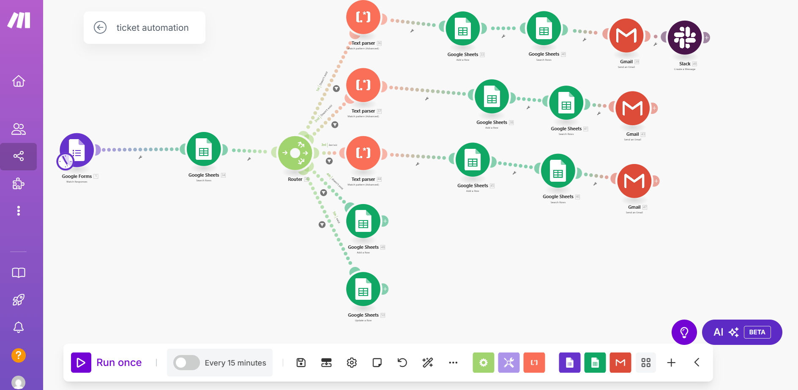

# How to Set Up the [Workflow Name] in Make (Integromat)
### Overview
This workflow automates the process from a submitted Google Form through various actions like parsing, updating Google Sheets, sending emails via Gmail, and notifying on Slack. This is useful for managing form responses, categorizing them, and automating follow-ups.

**Before we dive into the setup, here’s what the complete workflow looks like in Make:**
 
 

This gives you a sense of how the modules are connected — from Google Forms, through Sheets and routers, all the way to Gmail and Slack. We’ll break this down step by step below.

# Tools Used
- Google Forms
- Google Sheets
- Make (Integromat)
- Gmail
- Slack
- Text Parser

##   1. Trigger: Google Forms Submission
- Module: Google Forms → Watch Responses
- This starts the scenario when someone submits a response.

##  2. Log Response in Google Sheets
- Module: Google Sheets → Add Row
- The response data is stored here for record-keeping
 Example: Create a Google Sheet with columns:

- First Name

- Last Name

- Contact

- Email

- Ticket subject

- Issue Description

- Priority

- Resolved

- Unresolved

- Date

## 3. Router
-  Module: Router
- Splits the flow based on conditions or logic (eg;the row number doesn't or does exist; that means if the ticket has been logged before if goes to the first route (add to row) if otherwise if goes to the next(update row) ).

## 4. Text Parser (Multiple Paths)
- Module: Text Parser (Custom Text / Keywords / Conditions)
- Used to extract specific information or categorize responses.
**Example:It detect keywords from the issue description, and determines the priority for each of the paths**
  - High:
  - Medium:
  - Low:

 ## 5. Google Sheets Updates 
- Module: Google Sheets → Update Cell(s)
- Used to update a row that  exist already
  Example: if a customer creates a ticket and it probably hasn't been resolved and then they create another ticket for the 
  same issue, the row will be updated instead of added to avoid duplicates

 ## 6. Gmail: Send Follow-up 
- Module: Gmail → Send Email
- After logging and parsing, this module sends an automated follow-up to the user.
 **Example:**
- Once a customer creates  a ticket an email is sent to them,assuring them that they are being heard and the issue 
  is being addressed.

 ## 7. Slack Notification
- Module: Slack → Send Message
- Sends summary or  alert to a Slack channel for high priority tickets and unresolved tickets
 **Example:**
  - When a high priority ticket is detected the team gets an alert in the slack channel,to enable immediate approach as a 
  team.
  - After the days work, list of unresolved tickets are sent to another slack channel to notify team members so  they start the next day resolving those tickets as quickly as possible.

  ## How to Customize
- Text Parser: Adjust the conditions/keywords based on your use case.
- Router: You can add more branches if you want to handle different kinds of responses differently.
- Gmail/Slack: Customize the message templates and recipients.

  ## Run Settings
- Schedule:runs Every 15 minutes
- For unresolved ticket, runs after work hours eg; 5:00pm

  ## Tips
- Use variable names that match the form questions for clarity.
- Test each module one at a time to catch errors early.
- Label each module in Make to avoid confusion when troubleshooting.

    

  

## 🚀 How to Set Up This Automation

1️⃣ **Prerequisites**
Before starting, ensure you have:
✅ A Make.com account for automation.

✅ A Google account with access to Forms & Sheets.

✅ A Slack workspace (with a webhook set up).

 ### 2️⃣ Setup Instructions
 
 **Step 1: Create a Google Form for Ticket Submission**
Go to Google Forms and create a new form.

Add fields like Name, Contact, Email, Ticket Subject,Issue description.

📌 Example:
 
 
 

**Step 2: Connect Google Forms to Make.com**
Create a new scenario in Make.com.

Add a Google Forms module → Select "Watch Responses".

**Step 3: Add Google Sheets for Ticket Logging**
Create a Google Sheet with columns:

✅ First Name

✅Last Name

✅Contact

✅Email

✅Ticket subject

✅Issue Description

✅Priority

✅Resolved

✅Unresolved

✅ Date

📌 Example:

**Step 4: Add a Text Parser for Ticket Prioritization**
Add the Text Parser module in Make.com.

Define keywords for High, Medium, and Low Priority.

A text parser scans the ticket description and assigns a priority level:

- High Priority → Contains words like “urgent” or “critical.”

- Medium Priority → Contains words like “issue” or “bug.”

- Low Priority → No major keywords detected.

**Step 5: Automate Slack & Email Notifications**
Add Slack Webhook module → Send alerts to the correct channel.

Add Email module → Send automated responses to customers.

**Step 6: Automate End-of-Day Reports**
Add a Google Sheets module → Filter unresolved tickets.

Add a Slack module → Send summary report.
