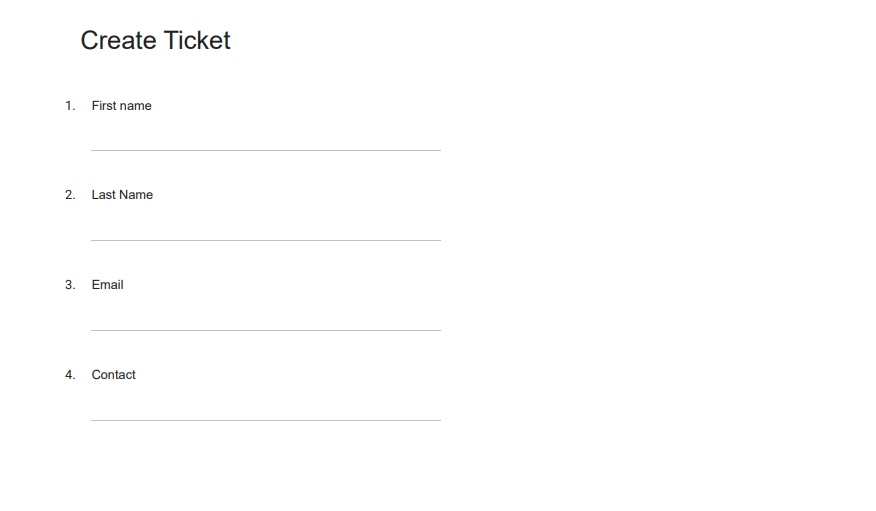
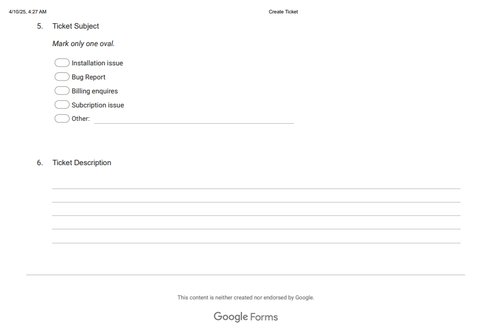
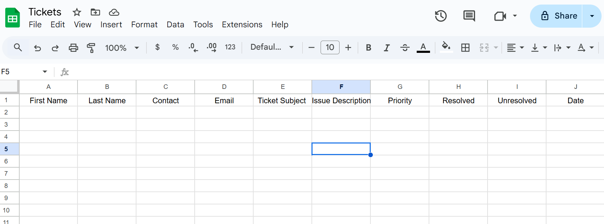

## 🚀 How to Set Up This Automation

1️⃣ **Prerequisites**
Before starting, ensure you have:
✅ A Make.com account for automation.

✅ A Google account with access to Forms & Sheets.

✅ A Slack workspace (with a webhook set up).

 ### 2️⃣ Setup Instructions
 
 **Step 1: Create a Google Form for Ticket Submission**
Go to Google Forms and create a new form.

Add fields like Name, Contact, Email, Ticket Subject,Issue description.

📌 Example:
 
 
 

**Step 2: Connect Google Forms to Make.com**
Create a new scenario in Make.com.

Add a Google Forms module → Select "Watch Responses".

**Step 3: Add Google Sheets for Ticket Logging**
Create a Google Sheet with columns:

✅ First Name

✅Last Name

✅Contact

✅Email

✅Ticket subject

✅Issue Description

✅Priority

✅Resolved

✅Unresolved

✅ Date

📌 Example:

**Step 4: Add a Text Parser for Ticket Prioritization**
Add the Text Parser module in Make.com.

Define keywords for High, Medium, and Low Priority.

A text parser scans the ticket description and assigns a priority level:

- High Priority → Contains words like “urgent” or “critical.”

- Medium Priority → Contains words like “issue” or “bug.”

- Low Priority → No major keywords detected.

**Step 5: Automate Slack & Email Notifications**
Add Slack Webhook module → Send alerts to the correct channel.

Add Email module → Send automated responses to customers.

**Step 6: Automate End-of-Day Reports**
Add a Google Sheets module → Filter unresolved tickets.

Add a Slack module → Send summary report.
