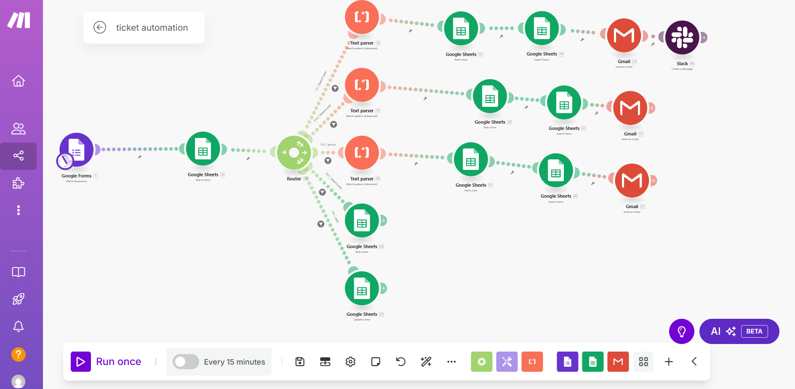

# 🚀 Set Up a Smart Support Ticket Workflow Automation in Make (formerly Integromat)
Looking to take the manual effort out of managing support tickets? This workflow automates everything — from the moment a user submits a Google Form to follow-ups via Gmail and team notifications on Slack. Whether you're managing support solo or with a team, this setup saves you time, keeps things organized, and ensures no ticket slips through the cracks.

---
## 🧩 What the Workflow Looks Like
Here’s a quick glance at how the automation flows inside Make:

From Google Form submissions to Sheets, Routers, Text Parsing, Gmail, and Slack — every step is connected to keep your support system running smoothly.

---
## 🛠️ Tools You'll Need
- Google Forms – for collecting ticket submissions
- Google Sheets – to log and track ticket details
- Make (Integromat) – the automation engine
- Gmail – for automated follow-up emails
- Slack – for real-time team notifications
- Text Parser – to detect issue types and assign priority
---

## ⚙️ Step-by-Step Setup
### 1. 🔔 Trigger: Google Form Submission
Module: Google Forms → Watch Responses

> Kicks off the automation whenever a new response is submitted.

### 2. 📊 Log the Response in Google Sheets
Module: Google Sheets → Add Row

> Stores the submitted data for tracking and future reference.

Suggested Sheet Columns:

1. First Name
2. Last Name
3. Contact
4. Email
5. Ticket Subject
6. Issue Description
7. Priority
8. Resolved / Unresolved
9. Date
---

### 3. 🔁 Route Based on Logic
Module: Router

> Splits the workflow depending on whether the ticket already exists.
- ✅ If the ticket is new, it’s added as a fresh row.
- 🔁 If it's a follow-up on an unresolved issue, the existing row is updated instead.
---
### 4. 🧠 Text Parser – Categorize and Prioritize
Module: Text Parser

> Automatically detects keywords from the issue description and sets the ticket's priority.

#### Example Conditions:

- High Priority – phrases like “not working”, “urgent”, “site is down”, “can’t access”
- Medium Priority – “error”, “glitch”, “broken”, “not displaying”
- Low Priority – “how”, “setup”, “feedback”, “question” (often FAQ-type inquiries)
---

### 5. 🔄 Update Existing Rows in Sheets
Module: Google Sheets → Update Cells

> Ensures follow-up tickets don’t get logged as duplicates by updating the existing row instead.
----
### 6. 📧 Send an Automated Email
Module: Gmail → Send Email

> Immediately follows up with the user to confirm receipt and provide reassurance.

#### Example Message:
"Thanks for reaching out — we’ve received your ticket and are on it. Our team will follow up shortly."

---
### 7. 💬 Notify the Team on Slack
Module: Slack → Send Message

> Alerts the team about high-priority or unresolved tickets.

#### Examples:

> High-priority tickets trigger real-time alerts in a shared support channel.

- At the end of the day, unresolved tickets are summarized in a message to help prioritize the next day’s tasks.
----
### 🛠️ Customize It Your Way
> Text Parser: Update the keywords/logic to fit your support style.

> Router: Add more branches for different ticket types or priorities.

> Gmail & Slack: Customize your email templates and Slack channels to fit your team’s workflow.

### ⏱️ Run Settings
- Main Scenario: Runs every 15 minutes

- Unresolved Tickets Summary: Triggers at the end of each workday (e.g., 5:00 PM)

### 💡 Pro Tips
- Match variable names with your form fields for clarity

- Test each module independently to catch issues early

- Label every module in Make — future-you will thank you when troubleshooting!

